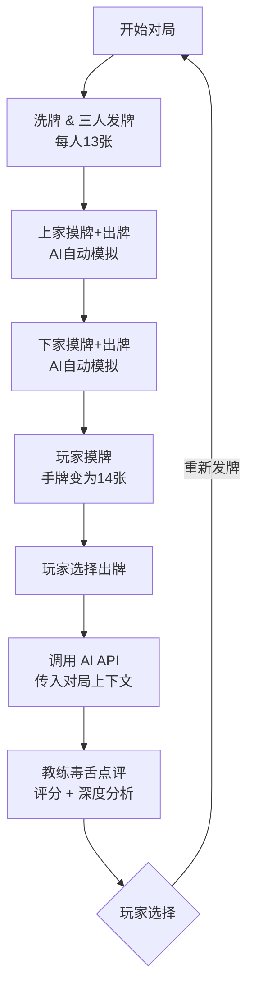

# 🀄 KaStar Sensei — 卡五星麻将 AI 教练

> **湖北襄阳卡五星麻将 原教旨主义 AI 教练**
>
> 一个专治平胡没梦想的毒舌训练系统，用 AI 教你打出卡五星的气势。


---

## 📖 项目简介

KaStar Sensei 是一个基于 Web 的卡五星麻将训练应用。系统模拟三人对局场景，玩家出牌后由 AI 教练（对接大模型 API）进行实时毒舌点评，帮助玩家养成卡五星意识、提高牌效分析能力。

### 核心特色

- 🎮 **三人对局模拟** — 上家（老王）和下家（老李）由 AI 自动出牌，弃牌公开可见
- 🤖 **AI 毒舌教练** — 对接大模型 API，针对每次出牌给出 S/A/B/C/F 评分和深度分析
- 🀄 **SVG 矢量麻将牌** — 纯 SVG 渲染的高保真牌面，筒子、条子、字牌各具特色
- 🎯 **卡五星执念检测** — 自动判断是否拆了 4-6 搭子，错过卡五星机会必骂
- ⚡ **出牌耗时追踪** — 超过 8 秒的磨叽操作会被嘲讽

---

## 🏗️ 技术架构

```
src/
├── app/
│   ├── api/feedback/
│   │   └── route.ts          # AI 反馈 API（对接 Anthropic SDK）
│   ├── page.tsx               # 主页面（游戏界面）
│   ├── layout.tsx             # 布局
│   └── globals.css            # 全局样式
├── components/
│   └── MahjongTile.tsx        # SVG 麻将牌组件（牌面 + 牌背）
├── engine/
│   └── GameEngine.ts          # 游戏引擎（发牌、洗牌、排序、AI出牌）
└── models/
    └── mahjong.ts             # 数据模型（Tile、TileType、TrainingSession）
```

### 技术栈

| 层级       | 技术                              |
| ---------- | --------------------------------- |
| 前端框架   | Next.js 16 (App Router)           |
| UI 渲染    | React 19 + Tailwind CSS 4         |
| 麻将牌渲染 | 纯 SVG 矢量图（MahjongTile 组件） |
| AI 对接    | Anthropic SDK → 兼容 API          |
| 语言       | TypeScript 5                      |

---

## 🎮 游戏流程



### 传给 AI 的对局上下文

```json
{
  "当前巡目": 1,
  "手牌_出牌前": ["1筒", "3筒", "4筒", "6筒", ...],
  "打出的牌": "4筒",
  "剩余手牌": ["1筒", "3筒", "6筒", ...],
  "你的弃牌堆": ["4筒"],
  "场面已见牌_其他两家弃牌": ["9条", "白板"],
  "耗时ms": 3200,
  "出牌前有卡五星潜力": true,
  "出牌后有卡五星潜力": false,
  "打出的牌是否拆了4或6": true,
  "打出的牌在手上有几张": 1,
  "牌堆剩余张数": 42
}
```

---

## 🧠 AI 教练评判维度

| 维度             | 触发条件                      | 严重程度       |
| ---------------- | ----------------------------- | -------------- |
| **卡五星执念**   | 拆了 4-6 搭子，放弃卡五星潜力 | 🔴 最高（F级） |
| **杠牌贪婪法则** | 有 3-4 张一样的牌却拆了       | 🟠 高          |
| **对子保护**     | 拆了有碰牌潜力的对子          | 🟡 中          |
| **孤张优先**     | 正确打出没有搭子的孤张        | 🟢 加分        |
| **速度惩罚**     | 出牌耗时 > 8 秒               | 🟡 中          |
| **综合牌效**     | 结合整体手牌结构分析          | 🔵 基础        |

语言风格：湖北方言（搞么名堂、冲壳子、脑壳有包、扯皮...）

---

## 🚀 快速开始

### 环境要求

- Node.js 18+
- 已配置 Anthropic 兼容 API 的环境变量：
  - `ANTHROPIC_API_KEY`
  - `ANTHROPIC_BASE_URL`（可选，默认为 Anthropic 官方）

### 安装 & 运行

```bash
# 安装依赖
npm install

# 启动开发服务器
npm run dev
```

打开 [http://localhost:3000](http://localhost:3000) 开始训练。

---

## 🀄 卡五星规则速览

- **牌库**：筒（1-9）× 4 + 条（1-9）× 4 + 中发白 × 4 = **84 张**
- **人数**：三人
- **限制**：**不能吃牌**，只能碰、杠
- **卡五星**：手持 4、6（同花色），听 5 并胡 5，翻倍
- **亮倒**：听牌后公开手牌，胡牌翻倍，但不能换牌

---

## 📋 TODO

### 近期目标

- [x] **多巡对局** — 支持连续多轮摸牌出牌，及自摸胡牌判定
- [ ] **碰牌/杠牌操作** — 当其他玩家打出的牌可以碰/杠时，打断当前流程并提供操作选项
- [ ] **点炮胡牌** — 支持检测其他玩家打出的牌是否能胡
- [ ] **亮倒（Liang Dao）** — 听牌后支持亮倒操作，系统自动接管后续抽牌
- [ ] **向听数计算** — 实现完整的向听数算法，精确计算距离胡牌的步数
- [ ] **进张概率分析** — 根据场面已见牌计算每张进张的剩余概率

### 中期目标

- [ ] **期望番数（EV）引擎** — `进张概率 × 预期番数` 驱动推荐出牌
- [ ] **残局生成器** — 生成特定向听数的训练残局，而非完全随机发牌
- [ ] **对手策略升级** — 更智能的对手 AI，模拟不同风格（激进/保守）
- [ ] **历史记录 & 统计** — 保存训练记录，追踪评分趋势和进步
- [ ] **UI 打牌动画** — 出牌、摸牌、翻牌的过渡动画

### 远期目标

- [ ] **完整三人实时对局** — 支持完整的多巡交互式对局
- [ ] **多人联机** — WebSocket 实时对战 + AI 旁观点评
- [ ] **移动端适配** — 响应式布局优化，支持触屏操作
- [ ] **番数计算器** — 完整的卡五星番数计算（平胡/卡五星/杠上开花等）
- [ ] **语音点评** — TTS 朗读毒舌教练的评价

---

## 📄 License

MIT
